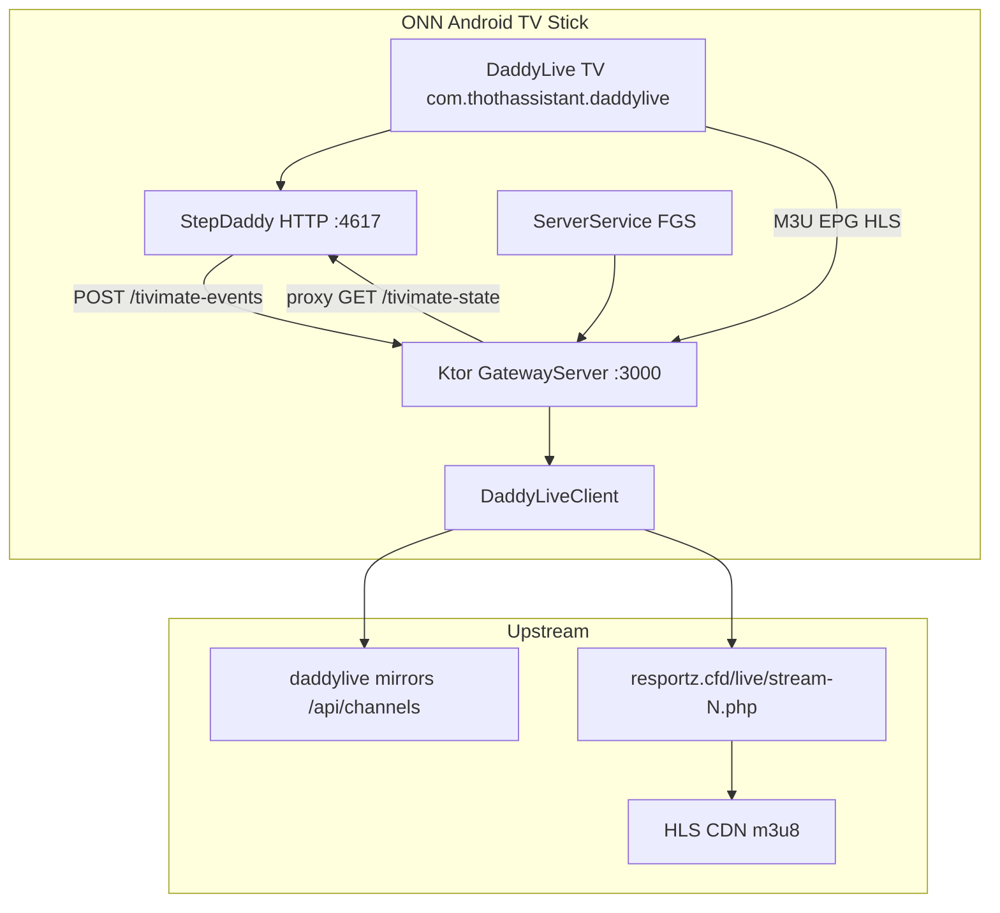

# Architecture — StepDaddy Native Android Gateway

Native rewrite of the Termux headless gateway from **[StepDaddy Web](~/Programs/stepdaddy-web)**.

User-facing two-app overview: [docs/TWO-APP.md](docs/TWO-APP.md).

## Design goals

| Constraint | Decision |
|------------|----------|
| ONN Android TV stick (ARM, low RAM, no keyboard) | Foreground service, lean UI, direct CDN streams |
| TiviMate on same device | Bind `0.0.0.0:3000`, loopback URLs unchanged |
| Optional TiviMate Daddy patch | Bidirectional telemetry on `:3000` ↔ `:4617` |
| Abandon Termux/Python | Kotlin only — no Chaquopy, no FastAPI |
| Gateway first | No web UI, mapping UI, or Reflex stack |

## Two-app topology

**Independent operation:** Gateway alone serves any IPTV client. TiviMate Daddy without gateway cannot play (no playlist source). Together: auto-setup, tune, boot-tune, event telemetry.

## Stack

| Layer | Choice | Rationale |
|-------|--------|-----------|
| Language | Kotlin 1.9 | First-class Android, coroutines |
| HTTP server | Ktor 2.3 + CIO engine | Mirrors FastAPI routing; async; small footprint |
| Upstream HTTP | OkHttp 4.12 | Sync calls off IO dispatcher; redirect follow |
| JSON | kotlinx.serialization | Channel API parsing |
| Service | `LifecycleService` + `dataSync` FGS | Keeps server alive under TV memory pressure |
| UI | AppCompat activity (TV launcher) | URL copy for TiviMate setup |

**SDK:** minSdk 24, compile/target 34

## Version tracking

| Component | Current | Where defined |
|-----------|---------|---------------|
| Gateway `versionName` | `3.0.27` | `app/build.gradle.kts` (from `STEPDADDY_VERSION`) |
| Gateway `versionCode` | `30027` | `app/build.gradle.kts` |
| Patch `patchVersion` | `1.2.1-boot-tune-safe` | `StepDaddyConstants.PATCH_VERSION` |
| TiViMate base | `4.6.1` (4610) | ONN USB mod APK |

Runtime: `GET /health` (gateway), `GET :4617/status` (patch), `GET /tivimate-handshake` (combined probe).

## Python → Kotlin route mapping

| Python (`backend.py`) | Kotlin | Status |
|----------------------|--------|--------|
| `GET /health` | `HealthRoutes.health` | ✅ |
| `GET /tivimate-setup` | `HealthRoutes.tivimateSetup` | ✅ |
| `GET /tivimate.m3u` | `PlaylistRoutes.tivimateUserPlaylist` | ✅ user (canonical) |
| `GET /tivimate-playlist.m3u8` | `PlaylistRoutes.tivimatePlaylist` | ✅ diagnostic alias |
| `GET /tivimate-setup-playlist.m3u8` | `PlaylistRoutes.tivimateSetupPlaylist` | ✅ diagnostic (50-ch bootstrap) |
| `GET /streamvault.m3u` | `PlaylistRoutes.streamVaultUserPlaylist` | ✅ user (canonical) |
| `GET /vlc.m3u` | `PlaylistRoutes.vlcUserPlaylist` | ✅ user (canonical) |
| `GET /tivimate-stream/{id}.m3u8` | `StreamRoutes.tivimateStream` | ✅ |
| `GET /stream/{id}.m3u8` | `StreamRoutes.genericStream` | ✅ |
| `GET /epg.xml` | `EpgRoutes.epgXml` | ✅ Light EPG |
| `GET /content/{path}` | `StreamRoutes` content proxy | ✅ |
| `POST /tivimate-events` | `TiviMateRoutes.postEvent` | ✅ Patch telemetry |
| `GET /tivimate-events` | `TiviMateRoutes.getEvents` | ✅ Ring buffer |
| `GET /tivimate-state` | `TiviMateRoutes.state` | ✅ Proxies :4617 |
| `GET /tivimate-handshake` | `TiviMateRoutes.handshake` | ✅ |
| Web UI / Reflex | — | Out of scope |

## Bidirectional API (gateway ↔ patch)

| Endpoint | Owner | Role |
|----------|-------|------|
| `POST /tivimate-events` | Gateway | Ingest patch events; normalize `type`→`event`, `detail`→`message` |
| `GET /tivimate-events` | Gateway | Last 100 events; `?since=` ms filter |
| `GET /tivimate-state` | Gateway | HTTP client to `127.0.0.1:4617/state` |
| `GET /tivimate-handshake` | Gateway | `deviceId`, `gatewayVersion`, feature URLs |
| `GET :4617/state` | Patch | Player snapshot (`wizardPhase`, `currentChannelNo`, …) |
| `GET :4617/boot-tune/{n}` | Patch | Save channel; deferred tune on resume |

Implementation: `TiviMateRoutes.kt`, `TiviMateEventStore`, `TiviMateController.probeState()`.

## Upstream logic mapping

### Channel list (`step_daddy.py::load_channels`)

Python:
- Tries `DLHD_BASE_URL` + `DLHD_BASE_URLS` mirrors
- DaddyLive mirrors: `GET {base}/api/channels` → JSON `[{channel_id, channel_name}]`
- Fallback: disk cache `dlhd_channels_cache.json`

Kotlin (`DaddyLiveClient`):
- Primary `dlhdBaseUrl` then `mirrorUrls` (default: `daddylive.eu` → `dlstreams.st` → `daddylive.li`)
- `GET {base}/api/channels` → JSON `[{channel_name, url}]` (embed URL per row; legacy `{channel_id, channel_name}` still supported)
- Channel id extracted from `url` query (`/player/embed.php?id=…`); embed URL stored per channel for stream resolve
- SharedPreferences JSON cache (`stepdaddy_channels`) includes optional `embed_url`

### Stream resolution (`_fetch_via_resportz`)

Python chain (legacy):
1. `https://resportz.cfd/live/stream-{id}.php`
2. Parse iframe `src`
3. Parse `source: window.atob('...')`
4. Base64 decode → m3u8 URL
5. Fetch manifest

Kotlin (`ResportzParser`): tries API embed URL, then `dlstreams.st` relay paths (`player`, `casting`, …), then legacy resportz hosts. Relay hosts rotate via mirror latency tracker.

### Special Events

Merged DaddyLive schedule (`tv.json` / `tv2.json`) + optional TheTvApp embeds. Guide channels use **HLS `.m3u8` wrappers** (not raw `.mp4`) so TiviMate lists them under Live TV. See `SpecialEventsMerger`, `GuideScheduleHlsManifest`.

### M3U rewrite (`rewrite_m3u8`)

Kotlin uses `M3u8Rewriter.rewrite(..., useProxy = false)` for direct CDN URLs; `/content/` proxy available for referer-sensitive players.

### EPG (`epg_headless.py` + `epg_schedule`)

Kotlin **light EPG** (`epg/` package):

| Module | Role |
|--------|------|
| `EpgConfig` | Feed URLs, 32MB cap, 48h programme window, 6h stale rebuild |
| `EpgChannelMapper` | Bundled `channel_epg_map.json` (channelId → xmltv id) |
| `EpgStore` | `files/epg/epg.xml`, feed gzip cache, meta JSON |
| `XmltvParser` | Streaming gzip block extractor (low RAM) |
| `LightEpgBuilder` | Download feeds, filter programmes, merge XMLTV |
| `EpgManager` | Background coroutine refresh; never blocks server bind |

## Configuration parity

| Env (Termux) | Android equivalent |
|--------------|-------------------|
| `PORT=3000` | `GatewayEnvironment.port` (default 3000) |
| `API_URL=http://127.0.0.1:3000` | `loopbackBase()` |
| `DLHD_BASE_URL` | `GatewayEnvironment.dlhdBaseUrl` |
| `DLHD_BASE_URLS` | `GatewayEnvironment.mirrorUrls` |
| `START_ON_BOOT=TRUE` | `BootReceiver` + `startOnBoot` pref |
| `TIVIMATE_DIRECT_STREAMS=TRUE` | Hard-coded direct mode |
| `CHANNEL_REFRESH_INTERVAL_SECONDS=600` | `GatewayConfig.CHANNEL_REFRESH_INTERVAL_MS` |
| — | `launchTivimateOnReady` (auto-launch player) |
| — | `tivimateBootTuneChannel` (default 51 → patch `/boot-tune`) |

## Service lifecycle

1. User launches app, boot receiver, or alarm/WM fallback fires
2. `ServerService` starts foreground notification
3. `GatewayServer` binds CIO on `0.0.0.0:port`
4. Background coroutine calls `DaddyLiveClient.ensureChannels()`
5. `GatewayHud.onCatalogReady` surfaces ready HUD; optionally `TiviMateLauncher.launch` + boot-tune poll
6. TiviMate / other clients hit Ktor routes → upstream fetch with cache

### Boot timing (ONN stick)

| Phase | Typical duration |
|-------|------------------|
| HTTP listening | 20–40 s after reboot |
| Channel catalog ready | 60–80 s cold |
| EPG first build | +1–5 min (may still serve stale cache) |
| Gateway → TiviMate launch | +2.5 s after ready (`LAUNCHER_SETTLE_MS`) |
| Patch boot-tune | +5 s after `MainActivity.onResume` (`BOOT_TUNE_DELAY_MS` in patch 1.2.1) |

Boot redundancy paths funnel through `GatewayStartHelper.startIfNeeded()`: `BootReceiver`, `BootStartActivity`, alarms, WorkManager, `ScreenWakeReceiver`, `GatewayEnsureAliveWorker`. See [BENCHMARKS.md](BENCHMARKS.md).

### Boot-tune crash fix

Patch `1.2.0-boot-fast` tuned immediately on resume, causing Room/SQLite WAL races on cold boot. **`1.2.1-boot-tune-safe`** defers tune by 5 s. Gateway side waits 2.5 s before launch, then polls `:4617/boot-tune` until patch HTTP is up.

## TiviMate integration layers

| Tier | Method | Client |
|------|--------|--------|
| 1 | Loopback M3U/EPG/HLS | Any IPTV app |
| 2 | `TiviMateLauncher` + `launchTivimateOnReady` | Stock or Daddy |
| 3 | `TiviMateController` → `:4617` HTTP | Daddy patch only |
| 4 | `POST /tivimate-events` telemetry | Daddy patch + gateway |

## Security notes

- Cleartext loopback allowed (`network_security_config`) for `127.0.0.1`
- No secrets in APK; upstream is public IPTV relay
- Patch HTTP `:4617` has no auth — device-local bind only
- Boot receiver exported — gated by `startOnBoot` pref

## Future phases

1. **Handshake `bootChannel`** — expose `tivimateBootTuneChannel` in `/tivimate-handshake` (currently `null`)
2. **Dashboard boot-tune UI** — edit channel without admin API
3. **Proxy auto-probe** — `channel_proxy_cache` equivalent
