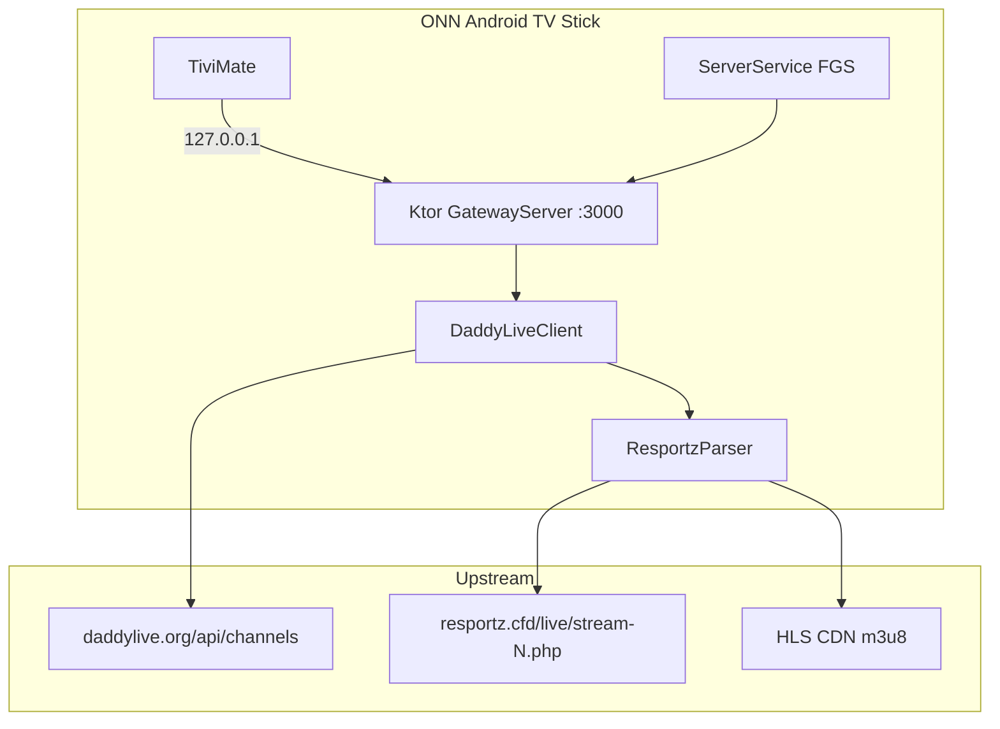

# Architecture — StepDaddy Native Android Gateway

Native rewrite of the Termux headless gateway from **[StepDaddy Web](~/Programs/stepdaddy-web)**.

## Design goals

| Constraint | Decision |
|------------|----------|
| ONN Android TV stick (ARM, low RAM, no keyboard) | Foreground service, lean UI, direct CDN streams |
| TiviMate on same device | Bind `0.0.0.0:3000`, loopback URLs unchanged |
| Abandon Termux/Python | Kotlin only — no Chaquopy, no FastAPI |
| Gateway first | No web UI, mapping UI, or Reflex stack |

## Stack

| Layer | Choice | Rationale |
|-------|--------|-----------|
| Language | Kotlin 1.9 | First-class Android, coroutines |
| HTTP server | Ktor 2.3 + CIO engine | Mirrors FastAPI routing; async; small footprint |
| Upstream HTTP | OkHttp 4.12 | Sync calls off IO dispatcher; redirect follow |
| JSON | kotlinx.serialization | Channel API parsing |
| Service | `LifecycleService` + `dataSync` FGS | Keeps server alive under TV memory pressure |
| UI | AppCompat activity (TV launcher) | URL copy for TiviMate setup |

**SDK:** minSdk 24, compile/target 34

## Process architecture



## Python → Kotlin route mapping

| Python (`backend.py`) | Kotlin | Status |
|----------------------|--------|--------|
| `GET /health` | `HealthRoutes.health` | MVP |
| `GET /tivimate-setup` | `HealthRoutes.tivimateSetup` | MVP |
| `GET /tivimate-playlist.m3u8` | `PlaylistRoutes.tivimatePlaylist` | MVP |
| `GET /tivimate-stream/{id}.m3u8` | `StreamRoutes.tivimateStream` | MVP |
| `GET /stream/{id}.m3u8` | `StreamRoutes.genericStream` | MVP |
| `GET /epg.xml` | `EpgRoutes.epgXml` | Light EPG (cached XMLTV) |
| `GET /health/tivimate` | — | TODO |
| `GET /content/{path}` | — | TODO (direct mode skips) |
| `GET /key/{url}/{host}` | — | TODO |
| `GET /channels/status` | — | TODO |
| Web UI / Reflex | — | Out of scope |

## Upstream logic mapping

### Channel list (`step_daddy.py::load_channels`)

Python:
- Tries `DLHD_BASE_URL` + `DLHD_BASE_URLS` mirrors
- DaddyLive mirrors: `GET {base}/api/channels` → JSON `[{channel_id, channel_name}]`
- Fallback: disk cache `dlhd_channels_cache.json`

Kotlin (`DaddyLiveClient`):
- Same mirror order from `GatewayEnvironment`
- `UpstreamChannelRow` deserialization
- SharedPreferences JSON cache (`stepdaddy_channels`)

### Stream resolution (`_fetch_via_resportz`)

Python chain:
1. `https://resportz.cfd/live/stream-{id}.php`
2. Parse iframe `src`
3. Parse `source: window.atob('...')`
4. Base64 decode → m3u8 URL
5. Fetch manifest

Kotlin (`ResportzParser`): identical regex chain with OkHttp.

### M3U rewrite (`rewrite_m3u8`)

Termux TiviMate config (`.env.termux.tivimate`):
```
PROXY_CONTENT=FALSE
TIVIMATE_DIRECT_STREAMS=TRUE
```

Kotlin MVP always uses `M3u8Rewriter.rewrite(..., useProxy = false)` — absolute CDN URLs, 720p variant filter enabled.

### Playlist (`tivimate_playlist`)

Python emits pipe-header stream lines:
```
{base}/tivimate-stream/{id}.m3u8|User-Agent=...|Referer={dlhd}/|Origin={dlhd}
```

Kotlin `PlaylistBuilder.tivimatePlaylist` matches format.

### EPG (`epg_headless.py` + `epg_schedule`)

Python: background thread pool, epgshare XML.gz feeds, fuzzy channel mapping, served XML disk cache.

Kotlin **light EPG** (`epg/` package):

| Module | Role |
|--------|------|
| `EpgConfig` | Feed URLs, 32MB cap, 48h programme window, 6h stale rebuild |
| `EpgChannelMapper` | Bundled `channel_epg_map.json` (channelId → xmltv id) |
| `EpgStore` | `files/epg/epg.xml`, feed gzip cache, meta JSON |
| `XmltvParser` | Streaming gzip block extractor (low RAM) |
| `LightEpgBuilder` | Download feeds, filter programmes, merge XMLTV |
| `EpgManager` | Background coroutine refresh; never blocks server bind |

Refresh runs after channel preload and on 12h interval. `/health` and `/tivimate-setup` expose `epgReady`, `epgProgrammeCount`, `epgAgeSeconds`.

## Configuration parity

| Env (Termux) | Android equivalent |
|--------------|-------------------|
| `PORT=3000` | `GatewayEnvironment.port` (default 3000) |
| `API_URL=http://127.0.0.1:3000` | `loopbackBase()` |
| `DLHD_BASE_URL` | `GatewayEnvironment.dlhdBaseUrl` |
| `DLHD_BASE_URLS` | `GatewayEnvironment.mirrorUrls` |
| `START_ON_BOOT=TRUE` | `BootReceiver` + `startOnBoot` pref |
| `TIVIMATE_DIRECT_STREAMS=TRUE` | Hard-coded direct mode in MVP |
| `CHANNEL_REFRESH_INTERVAL_SECONDS=600` | `GatewayConfig.CHANNEL_REFRESH_INTERVAL_MS` |

## Service lifecycle

1. User launches app or boot receiver fires
2. `ServerService` starts foreground notification
3. `GatewayServer` binds CIO on `0.0.0.0:port`
4. Background coroutine calls `DaddyLiveClient.ensureChannels()`
5. TiviMate requests hit Ktor routes → upstream fetch with cache

## Security notes

- Cleartext loopback allowed (`network_security_config`) for `127.0.0.1`
- No secrets in APK; upstream is public IPTV relay
- Boot receiver exported — standard for TV server apps; gated by `startOnBoot` pref

## Future phases

1. **Content proxy** — encrypted `/content/` route for players that need referer masking
2. **Proxy auto-probe** — `channel_proxy_cache` equivalent
3. **Legacy mirror scrape** — regex card parser for non-API mirrors
