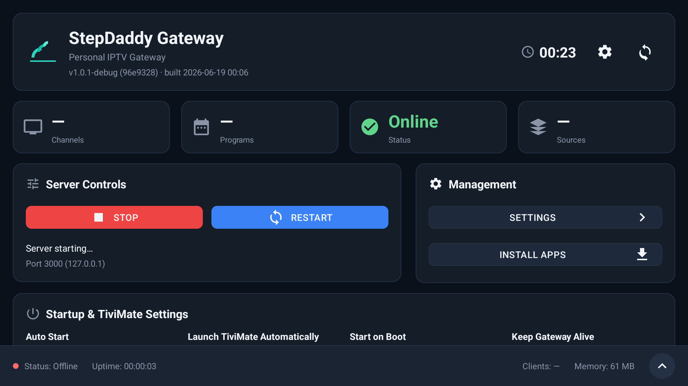
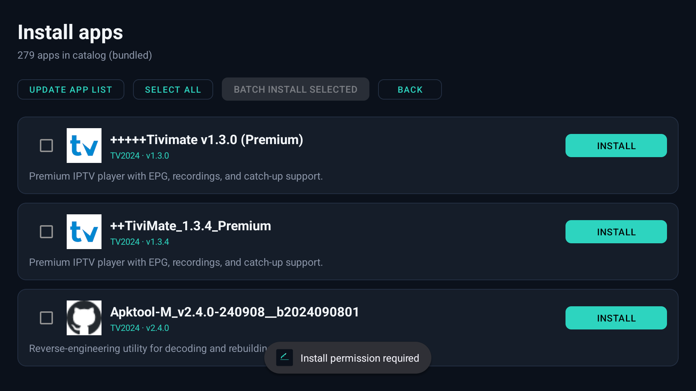
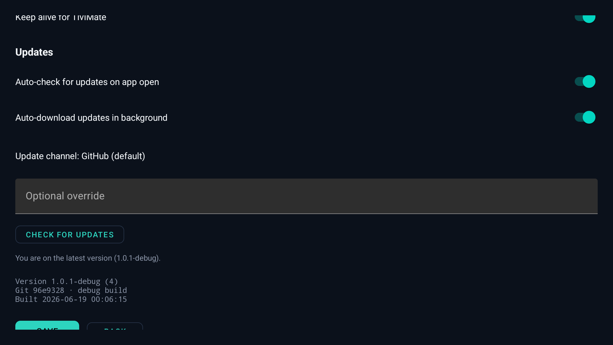
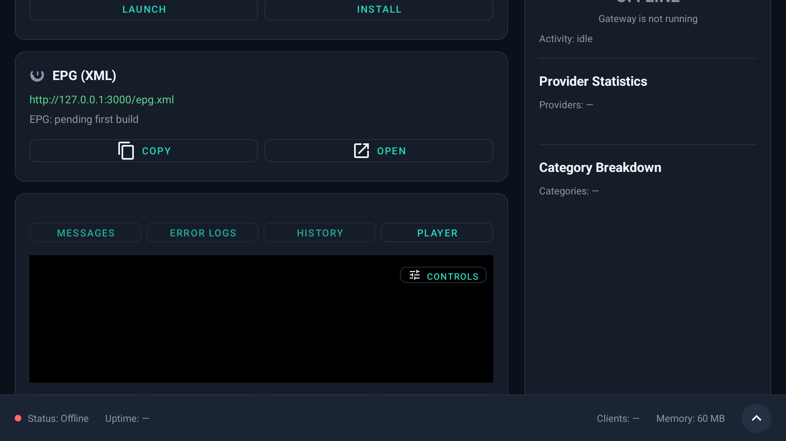
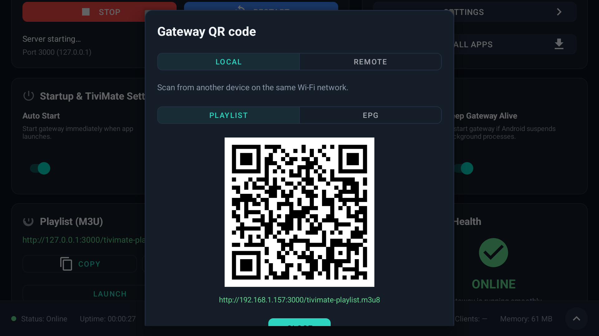

# StepDaddy Gateway

**Native Android TV IPTV gateway** — Kotlin + Ktor on port **3000**, built for ONN sticks, Google TV, and sideload installs. Replaces the Termux/Python stack with a single APK that serves TiviMate-compatible playlists and XMLTV EPG on-device.

| | |
|---|---|
| **Version** | 1.0.3 (`versionCode` 6) |
| **Package** | `com.thothassistant.stepdaddy.gateway` |
| **License** | [MIT](LICENSE) — see [LEGAL.md](LEGAL.md) / [DISCLAIMER.md](DISCLAIMER.md) |
| **Upstream parity** | [stepdaddy-livehd](https://github.com/thothassistantai-web/stepdaddy-livehd) (Linux/web gateway) |
| **TiviMate Daddy (patch APK)** | [tivimate-daddy](https://github.com/thothassistantai-web/tivimate-daddy) — TiViMate 4.6.1 mod releases; `tivimate-daddy-v*` tags on this repo are archived |

---

## For users

StepDaddy Gateway runs a small HTTP server on your Android TV device. Point **TiviMate** (or any M3U/XMLTV app) at local URLs — no command line, no Termux.

**Quick start**

1. Install the APK → [docs/INSTALL.md](docs/INSTALL.md)
2. Open the app → **Start server** → wait for the ready banner
3. Add playlist + EPG URLs in TiviMate → [docs/TUTORIAL.md](docs/TUTORIAL.md)

| URL | Purpose |
|-----|---------|
| `http://127.0.0.1:3000/tivimate-playlist.m3u8` | M3U playlist |
| `http://127.0.0.1:3000/epg.xml` | XMLTV guide |
| `http://127.0.0.1:3000/tivimate-stream/{id}.m3u8` | Per-channel HLS |
| `http://127.0.0.1:3000/health` | JSON status |

**Important:** This app is an **educational aggregator** — it does not host video. Third-party upstream sources may change or stop working. [DISCLAIMER.md](DISCLAIMER.md)

**Problems?** → [docs/TROUBLESHOOTING.md](docs/TROUBLESHOOTING.md) · [GitHub Issues](https://github.com/thothassistantai-web/stepdaddy-gateway-android/issues)

**Network modes:** Settings → Network — **Default** (loopback only), **Local** (same Wi‑Fi subnet), **Remote** (HTTPS tunnel + access token). See [docs/NETWORK-MODES.md](docs/NETWORK-MODES.md).

**Privacy:** [PRIVACY.md](PRIVACY.md)

### Screenshots

Captured on ONN Android TV (1080p). [More capture notes](docs/SCREENSHOT-CHECKLIST.md).

| Dashboard | Install apps | Settings |
|-----------|--------------|----------|
|  |  |  |

| Player tab | QR remote setup |
|------------|-----------------|
|  |  |

---

## For developers

### Requirements

- JDK 17+
- Android SDK API 34 (`ANDROID_HOME`, e.g. `~/Android/Sdk`)
- ADB for device deploy (optional)

### Build debug

```bash
cd stepdaddy-android
export ANDROID_HOME=~/Android/Sdk
./gradlew assembleDebug
```

| Output | Path |
|--------|------|
| **Debug APK** | `app/build/outputs/apk/debug/app-debug.apk` |
| Debug package | `com.thothassistant.stepdaddy.gateway.debug` |

```bash
adb install -r app/build/outputs/apk/debug/app-debug.apk
```

### Build release

```bash
./scripts/build-release.sh
```

See [docs/RELEASE.md](docs/RELEASE.md) for signing, GitHub Releases, and Play Store upload.

| Output | Path |
|--------|------|
| Release APK | `app/build/outputs/apk/release/app-release.apk` (signed) or `app-release-unsigned.apk` |
| Play bundle | `app/build/outputs/bundle/release/app-release.aab` |
| Copied artifacts | `release/stepdaddy-gateway-<version>.apk` |

### Tests

```bash
./gradlew testDebugUnitTest
```

### Architecture

[ARCHITECTURE.md](ARCHITECTURE.md) — Python → Kotlin route map, EPG pipeline, boot lifecycle.

### Project layout

```
stepdaddy-android/
  app/src/main/kotlin/.../gateway/
    ServerService.kt          # Foreground service
    GatewayServer.kt          # Ktor routing
    routes/                   # Health, playlist, stream, EPG
    epg/                      # Light EPG builder
    upstream/                 # DaddyLive + resportz
    ui/                       # TV dashboard, player, settings
  docs/                       # Install, tutorial, release, migration
  scripts/                    # build-release.sh, EPG export, FUSA tests
```

### Contributing

[CONTRIBUTING.md](CONTRIBUTING.md) · [CHANGELOG.md](CHANGELOG.md)

---

## Features

- Embedded Ktor HTTP server with enforced network modes (Default / Local / Remote)
- DaddyLive channel API + resportz HLS resolution (mirror failover)
- Light EPG (epgshare + iptv-org), channel logos
- Boot auto-start, overlay banner, TiviMate watch / keep-alive
- Built-in player, QR remote URLs, optional GitHub/Drive updates
- `/content/` segment proxy for TiviMate HLS compatibility

---

## Documentation index

| Doc | Description |
|-----|-------------|
| [docs/INSTALL.md](docs/INSTALL.md) | APK install, permissions, legacy conflict |
| [docs/TUTORIAL.md](docs/TUTORIAL.md) | TiviMate setup walkthrough |
| [docs/TROUBLESHOOTING.md](docs/TROUBLESHOOTING.md) | Boot, EPG, stream diagnostics |
| [docs/RELEASE.md](docs/RELEASE.md) | Version bump, signing, GitHub release |
| [docs/GITHUB-SETUP-NEEDED.md](docs/GITHUB-SETUP-NEEDED.md) | Credentials checklist for org publish |
| [docs/MIGRATION-PLAN.md](docs/MIGRATION-PLAN.md) | Repo mapping for thothassistantai-web |
| [docs/NETWORK-MODES.md](docs/NETWORK-MODES.md) | Default / Local / Remote access enforcement |
| [docs/REMOTE-ACCESS.md](docs/REMOTE-ACCESS.md) | Cloudflare Tunnel, Tailscale, access token |
| [PRIVACY.md](PRIVACY.md) | Privacy policy |
| [docs/SCREENSHOT-CHECKLIST.md](docs/SCREENSHOT-CHECKLIST.md) | Play Store capture list |
| [PLAY_STORE_LISTING.md](PLAY_STORE_LISTING.md) | Store description draft |
| [BENCHMARKS.md](BENCHMARKS.md) | ONN stick performance notes |

---

## Related projects

| Platform | Repository |
|----------|------------|
| Linux / web gateway | [stepdaddy-livehd](https://github.com/thothassistantai-web/stepdaddy-livehd) |
| Android TV remote (Linux) | [android-tv-connect](https://github.com/thothassistantai-web/android-tv-connect) |
