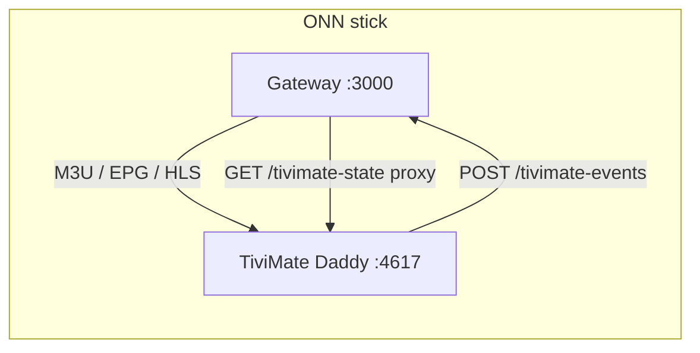

# Two-app architecture — Gateway + TiviMate Daddy

StepDaddy is a **two-app system** on Android TV. Each app works **alone** or **together**; together is the recommended ONN-stick experience.

| App | Package | Role |
|-----|---------|------|
| **StepDaddy Gateway** | `com.thothassistant.stepdaddy.gateway` | On-device IPTV server — M3U playlist, XMLTV EPG, HLS stream proxy on port **3000** |
| **DaddyLive TV** (StepDaddy patch, 2.3.0+) | `com.thothassistant.daddylive` | IPTV player with StepDaddy bridge — auto-setup, tune, loopback HTTP on port **4617**. Coexists with stock TiviMate. |
| **TiviMate Daddy** (legacy, ≤2.0.0 published) | `ar.tvplayer.tv` | Older fleet builds; **cannot** coexist with stock TiviMate (same package ID). |

Stock **official TiviMate** (`ar.tvplayer.tv`, 5.x) is supported as a **playlist-only** client with no programmatic control and can run **alongside** DaddyLive TV (2.3.0+).

---

## Deployment modes

### Mode A — Gateway only

Use any IPTV player (TiviMate official, IPTV Smarters, VLC, etc.).

1. Install and start StepDaddy Gateway.
2. Add `http://127.0.0.1:3000/tivimate-playlist.m3u8` and `http://127.0.0.1:3000/epg.xml` manually.
3. No port 4617, no auto-setup, no channel tune from the gateway.

**When to use:** You already have a TiviMate backup, want official 5.x, or only need the playlist server.

### Mode B — TiviMate Daddy only (no gateway)

**Not useful in practice** — the Daddy mod expects a gateway at `http://127.0.0.1:3000` for playlists and streams. Without the gateway, setup and playback fail.

### Mode C — Gateway + TiviMate Daddy (recommended)

1. Install **Gateway first** (or enable **Start on boot** before first TiviMate launch).
2. Install **TiviMate-4.6.1-StepDaddy.apk** (see [INSTALL.md](INSTALL.md)).
3. On first TiviMate launch, the patch auto-fetches `GET /tivimate-setup` and walks the playlist wizard.
4. Optional: enable **Launch TiviMate when ready** in Gateway settings — gateway opens TiviMate after the channel catalog loads and sends boot-tune via `:4617`.



---

## Version tracking

Track **both** version strings when debugging fleet sticks.

### StepDaddy Gateway

| Field | Source |
|-------|--------|
| `versionName` | `app/build.gradle.kts` → `BuildConfig.VERSION_NAME` |
| `versionCode` | Monotonic integer for APK updates |
| Runtime check | `GET http://127.0.0.1:3000/health` → `"version"` |

**Current release:** `3.0.27` (`versionCode` 30027) — see [CHANGELOG.md](../CHANGELOG.md).

### TiviMate Daddy (patch)

| Field | Source |
|-------|--------|
| `patchVersion` | Smali constant `StepDaddyConstants.PATCH_VERSION` |
| TiViMate base | `4.6.1` (`versionCode` 4610, ONN USB mod) |
| Runtime check | `GET http://127.0.0.1:4617/status` or `/state` → `patchVersion` |

**Current patch:** `2.1.0` — see [tivimate-daddy](https://github.com/thothassistantai-web/tivimate-daddy) patch version history.

### Fleet probe (one-liner)

```bash
curl -s http://127.0.0.1:3000/health | jq '{gateway: .version, channels: .channels}'
curl -s http://127.0.0.1:4617/status | jq '{patch: .patchVersion, setupDone: .setupDone}'
curl -s http://127.0.0.1:3000/tivimate-handshake | jq .
```

---

## TiviMate install options

| Option | APK | Control | Notes |
|--------|-----|---------|-------|
| **Daddy** (recommended) | `research/tivimate-apk/TiviMate-4.6.1-StepDaddy.apk` | Full — `:4617`, `stepdaddy://`, broadcasts, auto-setup | Built from `stepdaddy-patch/`; signed with `stepdaddy.keystore` |
| **Mod** (4.6.1 ONN) | `research/tivimate-apk/tivimate-usb.apk` | Manual playlist only | No StepDaddy bridge; jadx-decompilable |
| **Official** (5.3.x) | `https://files.tivimate.com/tivimate.apk` | Launch + ADB keyevents only | DexProtector; no `SettingsActivity` export; playlist URLs must be added manually |

Gateway **Install apps** screen can sideload the Daddy APK when a catalog URL is configured. Default catalog does not ship the binary — build locally or host the signed APK.

**Signature / package rule:** DaddyLive TV 2.3.0+ uses `com.thothassistant.daddylive` and installs beside stock TiviMate. Legacy StepDaddy builds on `ar.tvplayer.tv` still require uninstalling any other `ar.tvplayer.tv` app before switching variants (`adb install -r` only works with the same signing key).

---

## Gateway settings (integration)

| Setting | Pref key | Default | Effect |
|---------|----------|---------|--------|
| **Start on boot** | `start_on_boot` | on | `BootReceiver` + alarm/WM fallbacks start FGS |
| **Auto-start on launch** | `auto_start_on_launch` | on | Opening Gateway starts server if stopped |
| **Launch TiviMate when ready** | `launch_tivimate_on_ready` | on | After catalog ready, launch `MainActivity` once per boot |
| **Keep gateway alive (TiviMate watch)** | `tivimate_watch` | on | Recovery kicks when TiviMate is foreground |
| **Boot-tune channel** | `tivimate_boot_tune_channel` | `51` | Sent to patch `GET /boot-tune/{n}` after launch (no dashboard UI yet — use admin API or `stepdaddy-cli.sh`) |

**Auto-launch timing:** Gateway waits **2.5 s** after its own ready HUD before launching TiviMate (`GatewayHud.LAUNCHER_SETTLE_MS`), then polls patch HTTP every **500 ms** (up to **24** attempts) to save boot-tune.

---

## DaddyLive mirrors

Probed 2026-06-23 — only mirrors with a working `GET /api/channels` JSON list (1156 channels):

| Rank | URL | Latency (avg) | Status |
|------|-----|---------------|--------|
| 1 | `https://daddylive.eu` | ~534 ms | **Primary** (default) |
| 2 | `https://dlstreams.st` | — | Relay host (dlhd.pk/st redirect here) |
| 3 | `https://daddylive.li` | ~584 ms | Fallback |
| — | `https://daddylive.org` | — | **Seized** — do not use |

Gateway failover order for new installs:

1. **Primary** — `dlhdBaseUrl` (default `https://daddylive.eu`)
2. **Mirrors** — `https://dlstreams.st,https://daddylive.li,https://dlhd.st`

Edit in **Settings → Upstream → DaddyLive URL / Mirror URLs**. Active mirror is reported in `/health` and channel cache metadata. Existing installs keep saved prefs until cleared in Settings or via admin API; rebuild the gateway APK for defaults on fresh installs.

---

## Bidirectional API (summary)

Patch **pushes** events; gateway **proxies** player state for LAN/adb clients.

| Direction | Port | Endpoint | Purpose |
|-----------|------|----------|---------|
| Patch → Gateway | 3000 | `POST /tivimate-events` | Playback telemetry (`CHANNEL_CHANGED`, `SETUP_COMPLETE`, …) |
| Client → Gateway | 3000 | `GET /tivimate-events?since=` | Ring buffer (last 100 events) |
| Client → Gateway | 3000 | `GET /tivimate-state` | Proxies patch `GET :4617/state` |
| Client → Gateway | 3000 | `GET /tivimate-handshake` | Device id, gateway version, feature URLs |
| Gateway → Patch | 4617 | `GET /boot-tune/{n}`, `/tune/{n}`, … | Player control |

Full schemas: [stepdaddy-patch README](../../research/tivimate-apk/stepdaddy-patch/README.md#bidirectional-schemas-gateway--patch) and [.cursor/skills/tivimate-control/SKILL.md](../.cursor/skills/tivimate-control/SKILL.md).

---

## Boot timing & crash fix (boot-tune)

| Layer | Behavior |
|-------|----------|
| **Gateway boot** | HTTP often up in **20–60 s** on ONN; full channel count within **60–80 s** cold. EPG may lag. |
| **Gateway → TiviMate launch** | **+2.5 s** settle after ready; one launch per boot. |
| **Patch boot-tune** (`1.2.1-boot-tune-safe`) | **+5 s** defer after `MainActivity.onResume` so Room/SQLite WAL recovery finishes before tune (fixes parallel SQLite crash on cold boot). |
| **Earlier `1.2.0-boot-fast`** | Shorter defer — faster tune but crash risk on cold boot; superseded by `1.2.1`. |

If TiviMate crashes on first boot after reboot, confirm `patchVersion` is `1.2.1-boot-tune-safe` or newer.

---

## Related docs

- [ONN-QUICK-START.md](ONN-QUICK-START.md) — fastest path on a Google TV stick
- [INSTALL.md](INSTALL.md) — APK install and permissions
- [TUTORIAL.md](TUTORIAL.md) — manual TiviMate setup
- [TROUBLESHOOTING.md](TROUBLESHOOTING.md) — boot, streams, patch HTTP
- [ARCHITECTURE.md](../ARCHITECTURE.md) — Kotlin modules and routes
